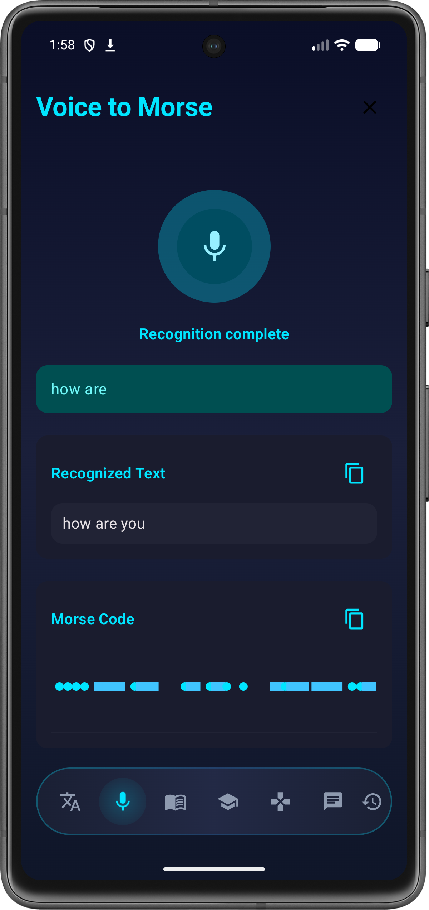
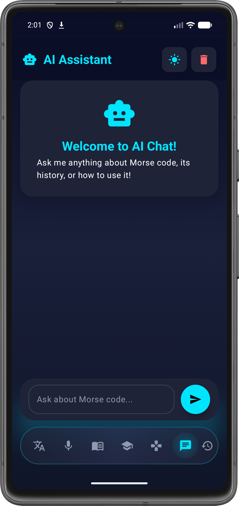
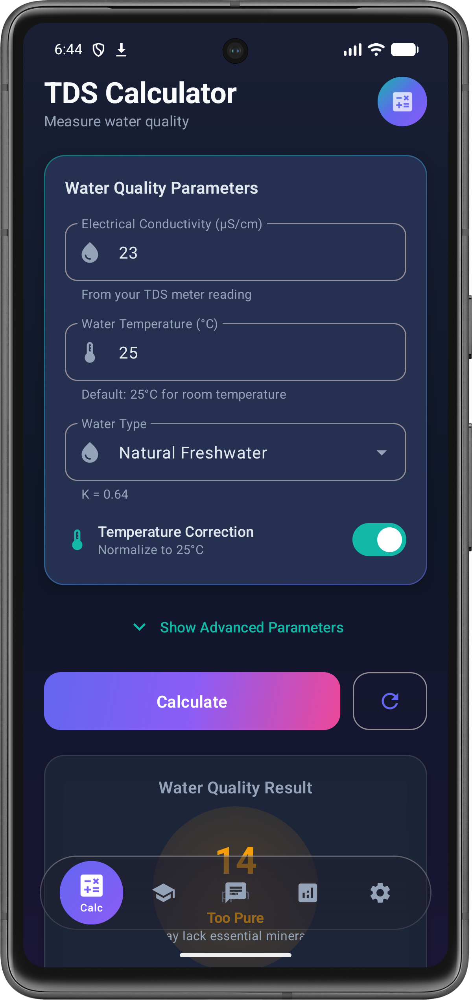
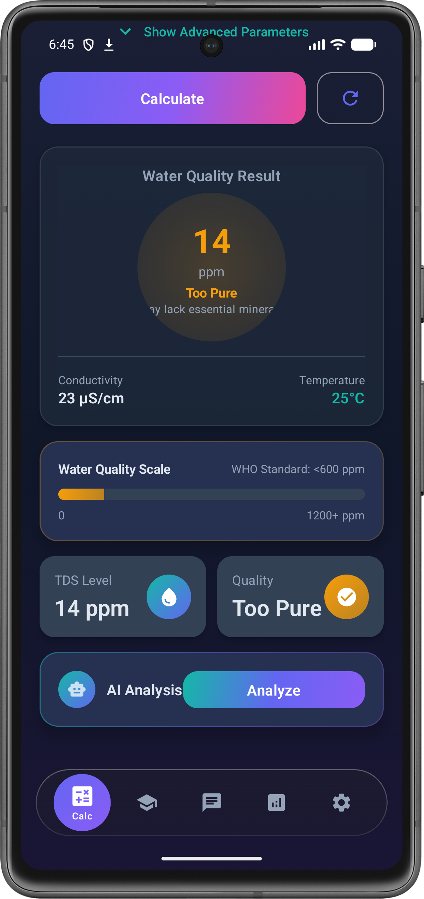
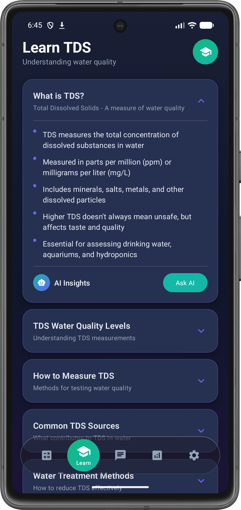
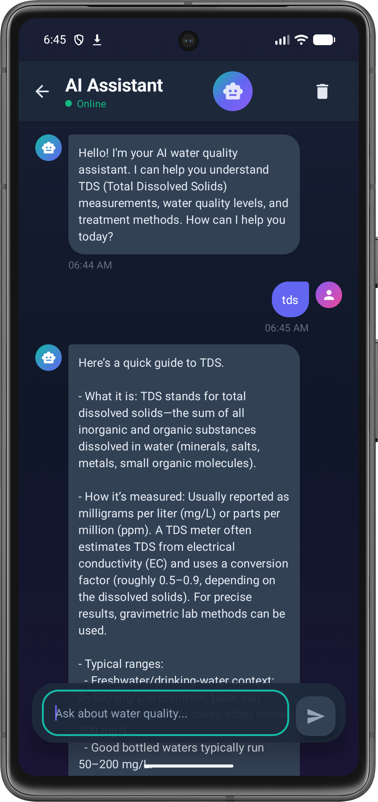

<div align="center">

# 💧 TDS Water Quality Calculator

### AI-Powered Water Quality Measurement App

[](https://kotlinlang.org)
[](https://developer.android.com/jetpack/compose)
[](https://m3.material.io)
[](LICENSE)
[](https://developer.android.com)

**A premium, AI-powered TDS (Total Dissolved Solids) water quality calculator Android application built with Kotlin and Jetpack Compose.**

[Features](#-features) • [Screenshots](#-screenshots) • [Tech Stack](#-tech-stack) • [Installation](#-installation) • [Contact](#-contact)

</div>

---

## ✨ Features

### 💧 TDS Water Quality Calculator
- Real-time TDS calculation from electrical conductivity
- Temperature compensation for accurate readings
- Customizable conversion factor (default 0.64)
- Water quality rating system (Excellent to Unacceptable)
- Detailed quality breakdown with visual indicators
- Animated progress indicators and visualizations

### 📚 Learning Center
- Comprehensive TDS and water quality information
- Understanding TDS measurements (ppm/mg/L)
- Water quality levels and safety standards
- Measurement methods and best practices
- Water treatment options (RO, Distillation, etc.)
- Collapsible cards for easy navigation

### 🤖 AI Chat Assistant (Powered by Pollinations.AI)
- Interactive AI chatbot for water quality queries
- Real-time responses about TDS and water safety
- Typing indicators and smooth animations
- Chat history with timestamp
- Expert advice on water treatment methods
- Floating input box with keyboard handling

### 📊 AI Analysis
- Water quality assessment score
- Detailed breakdown of TDS levels
- AI-powered recommendations for water treatment
- Visual charts and progress bars
- Personalized water quality improvement tips

### ⚙️ Settings
- Light/Dark/System theme modes
- Smooth theme transitions
- Notification preferences
- App information

## Design Highlights

- **Edge-to-edge layout** with proper window insets handling
- **Glassmorphic floating navigation bar** with 5 tabs
- **Premium gradient designs** with Indigo → Purple → Pink color scheme
- **Smooth animations** throughout the app
- **Material Design 3** principles
- **Responsive** for all screen sizes

## Technical Stack

- **Language**: Kotlin
- **UI Framework**: Jetpack Compose
- **Architecture**: MVVM with Clean Architecture
- **Dependency Injection**: Hilt
- **State Management**: StateFlow & Compose State
- **Data Storage**: DataStore Preferences
- **Minimum SDK**: 26 (Android 8.0)
- **Target SDK**: 34 (Android 14)

## Package Structure

```
com.kreggscode.tdscalculator
├── data
│   ├── models          # Data models
│   ├── preferences     # DataStore preferences
│   └── repository      # Business logic
├── di                  # Dependency injection modules
├── ui
│   ├── components      # Reusable UI components
│   ├── navigation      # Navigation logic
│   ├── screens         # App screens
│   ├── theme           # Theme and styling
│   └── viewmodels      # ViewModels
├── MainActivity.kt
└── TDSApplication.kt
```

## Key Components

### Premium UI Components
- `PremiumCard` - Gradient-bordered elevated cards
- `GlassmorphicCard` - Frosted glass effect cards
- `AnimatedGradientButton` - Spring-animated gradient buttons
- `StatCard` - Metric display cards with icons
- `AnimatedProgressBar` - Smooth progress indicators
- `PulsingIcon` - Breathing animations for AI features

### Screens
1. **SplashScreen** - Animated app launch
2. **CalculatorScreen** - TDS calculation interface
3. **LearningScreen** - Educational content
4. **ChatScreen** - AI assistant chat
5. **AnalysisScreen** - Water quality analysis and insights
6. **SettingsScreen** - App preferences

## Building the App

1. Clone the repository
2. Open in Android Studio (Hedgehog or later)
3. Sync Gradle files
4. Run on emulator or device

## Requirements

- Android Studio Hedgehog (2023.1.1) or later
- JDK 17
- Android SDK 34
- Gradle 8.2

## Color Palette

- **Primary**: Indigo (#6366F1) → Purple (#8B5CF6) → Pink (#EC4899)
- **AI Gradient**: Teal (#14B8A6) → Indigo → Purple
- **Success**: Emerald (#10B981) → Teal
- **Warning**: Amber (#F59E0B) → Red (#EF4444)

## 📸 Screenshots

<div align="center">

| Splash Screen | Calculator | AI Chat |
|:---:|:---:|:---:|
|  |  |  |

| Learning | Analysis | Settings |
|:---:|:---:|:---:|
|  |  |  |

</div>

## 🚀 Installation

### Prerequisites
- Android Studio Hedgehog (2023.1.1) or later
- JDK 17
- Android SDK 34
- Gradle 8.2

### Steps

1. **Clone the repository**
   ```bash
   git clone https://github.com/kreggscode/TDS-Ai.git
   cd TDS-Ai
   ```

2. **Open in Android Studio**
   - Launch Android Studio
   - Click `File → Open`
   - Select the project directory

3. **Sync Gradle**
   - Wait for Gradle sync to complete
   - All dependencies will be downloaded automatically

4. **Run the app**
   - Click the Run button (▶️) or press `Shift + F10`
   - Select an emulator or connected device

## 📱 Download

[](https://play.google.com/store/apps/details?id=com.kreggscode.tdscalculator)

## 🌊 What is TDS?

**TDS (Total Dissolved Solids)** measures the concentration of dissolved substances in water, including:
- Minerals (Calcium, Magnesium, Potassium)
- Salts (Sodium chloride, Carbonates)
- Metals (Iron, Copper, Zinc)
- Other dissolved particles

### Water Quality Levels:
- **50-150 ppm**: Excellent - Ideal for drinking
- **150-300 ppm**: Good - Acceptable for drinking
- **300-500 ppm**: Fair - May affect taste
- **500-900 ppm**: Poor - Not ideal for drinking
- **Above 900 ppm**: Unacceptable - Requires treatment

### How It Works:
1. **Measure** electrical conductivity (µS/cm) with a TDS meter
2. **Apply** temperature compensation for accuracy
3. **Calculate** TDS = Conductivity × Conversion Factor
4. **Assess** water quality based on TDS level
5. **Get** AI-powered recommendations for treatment

## 🤝 Contributing

Contributions are welcome! Please feel free to submit a Pull Request.

## 📄 License

This project is for educational and demonstration purposes.

## 📧 Contact

**Developer**: KreggsCode

- 📧 Email: [kreg9da@gmail.com](mailto:kreg9da@gmail.com)
- 📦 Package: `com.kreggscode.tdscalculator`
- 🔖 Version: 1.0.0
- 🌐 Play Store: [Download App](https://play.google.com/store/apps/details?id=com.kreggscode.tdscalculator)

## 🌐 Links

- [Privacy Policy](https://kreggscode.github.io/TDS-Ai/privacy.html)
- [Terms & Conditions](https://kreggscode.github.io/TDS-Ai/terms.html)

---

<div align="center">

**Built with ❤️ using Jetpack Compose and Material Design 3**

⭐ Star this repo if you find it helpful!

</div>
